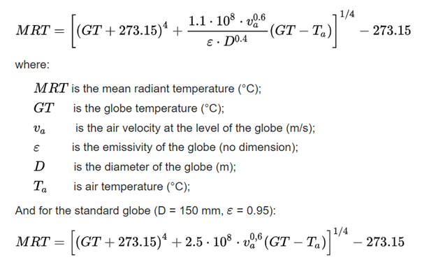

```{r include = FALSE}
library(tidyverse)
library(doParallel)
library(R.utils)
library(glmnet)
library(ggplot2)
library(emmeans)
library(nlme)
library(lme4)
library(rio)
library(chron)
library(lubridate)
options(digits = 7)
registerDoParallel()
getDoParWorkers()
```

```{r include = FALSE}
load("sensordata.RData")
```

```{r include = FALSE}
wind1creation<-function(data, condition){

  sensordata <- data
  sensordata <- sensordata %>% dplyr::select(time, wind_speed_10min_average, wind_direction_10min_average)
  sensordata <- na.omit(sensordata)
  sensordata$time <- strptime(sensordata$time, format="%Y-%m-%dT%H:%M:%OSZ")
  sensordata$time <- sensordata$time - hms("05:00:00")
  sensordata <- sensordata %>% separate(time, c('Date','Time'), sep = " ")  %>% filter(Date == "2022-08-19")
  if (condition == TRUE){ sensordata <- sensordata %>% filter(Time > "14:00:00" & Time < "18:00:00") }
  colnames(sensordata)[3] <- "wind_speed_avg"
  colnames(sensordata)[4] <- "wind_dirc_avg"
  sensordata <- sensordata %>% dplyr::select(-Date, -wind_dirc_avg)
  sensordata$Time <- times(sensordata$Time)
  
  sensordata <- do.call(rbind,
        lapply(seq(1, nrow(sensordata), 2), function(i){
          x <- sensordata[ i:(i + 1), , drop = TRUE]
          res <- rbind(x, colSums(x)/2)
          rownames(res)[ nrow(res) ] <- paste(rownames(x), collapse = "_")
          res
        }))
  
  sensordata <- sensordata %>% slice(which(row_number() %% 3 == 0))
  sensordata <- na.omit(sensordata)
  
  return(sensordata)
}
THcreation<-function(data, condition){

  sensordata <- data
  sensordata$timestamp <- strptime(sensordata$timestamp, format="%Y-%m-%dT%H:%M:%OSZ")
  sensordata$timestamp <- sensordata$timestamp - hms("05:00:00")
  sensordata <- sensordata %>% separate(timestamp, c('Date','Time'), sep = " ")  %>% filter(Date == "2022-08-13")
  if (condition == TRUE){
  sensordata <- sensordata %>% filter(Time > "14:00:00" & Time < "18:00:00")
  }
  sensordata <- sensordata[1:3]
  colnames(sensordata)[3] <- "air_temp"
  
  return(sensordata)
}

MRTcreation<-function(data, condition){

  sensordata <- data
  sensordata$timestamp <- strptime(sensordata$timestamp, format="%Y-%m-%dT%H:%M:%OSZ")
  sensordata$timestamp <- sensordata$timestamp - hms("05:00:00")
  sensordata <- sensordata[,-c(4,5)]
  sensordata <- sensordata %>% separate(timestamp, c('Date','Time'), sep = " ")  %>% filter(Date == "2022-08-13")
  if (condition == TRUE){
  sensordata <- sensordata %>% filter(Time > "14:00:00" & Time < "18:00:00")
  }
  colnames(sensordata)[3] <- "air_temp"
  colnames(sensordata)[4] <- "GT"
  
  return(sensordata)
}

MRTwindmerge<-function(data, Number, Category, wind){

  data <- MRTcreation(data, TRUE) 
  data <- cbind(data, windspeed = wind)
  data$MRT <- ((data$GT + 273.15)^4 + 2.5*(10^8)*((data$windspeed)^0.6)*(data$GT - data$air_temp))^0.25 - 273.15
  data$ID <- Number
  data$Label <- Category
  
  return(data)
}

data_vis <- function(data_mrt, data_th, MRT_N, TH_N, label){
  
  data_mrt <- MRTcreation(data_mrt, FALSE)
  data_mrt$Time <- strptime(data_mrt$Time, format = "%H:%M:%S")
  data_th <- THcreation(data_th, FALSE)
  data_th$Time <- strptime(data_th$Time, format = "%H:%M:%S")
  #names(unclass(data_th$Time))
  
  ggplot(NULL, aes(Time$hour, `air_temp`)) + 
      geom_point(data = data_mrt, aes(color='MRT')) +
      geom_point(data = data_th, aes(color='TH')) + ylab("Air Temperature") + xlab("Time") + 
    ggtitle(paste(MRT_N, "versus", TH_N, "-", label)) + 
    theme(axis.text.x = element_text(angle = 90, vjust = 0.5, hjust=1, size = 9)) +
    scale_color_manual(name='Legend',
                     breaks=c('MRT', 'TH'),
                     values=c('MRT'='red', 'TH'='blue')) + theme(
    legend.position = c(0.02, .95),
    legend.justification = c("left", "top"),
    legend.box.just = "left",
    legend.margin = margin(6, 6, 6, 6)
    )
}
```


## MRT vs TH {-}

Both MRT and TH sensors capture and report air temperature. The difference is that the TH sensor has a white plastic probe while the MRT sensor has a shiny probe. We need to see if there is any difference in capturing data during different hours of the day. The plots below visualize the air temperature captured from MRT and TH sensors for an entire day.

```{r, echo = FALSE, message=FALSE, warning=FALSE, fig.width=10,fig.height=5, layout="l-body-outset"}
data_vis(data$MRT3, data$TH11, "MRT3", "TH11", "Sunny")
data_vis(data$MRT1, data$TH10, "MRT1", "TH10", "Sunny")
data_vis(data$MRT5, data$TH5, "MRT5", "TH5", "Shade")
```

## Anemometer 1 vs Anemometer 2 {-}

Anemometer 1 is located on a light pole in the middle of the parking lot of Pegasus building while Anemometer 2 is located under a oak tree which means Anemometer 1 is in an open area while Anemometer 2 is under a shaded area. The plots below visualize the wind speed of Anemometer 1 & 2 for an entire day. 

```{r, echo = FALSE, message=FALSE, warning=FALSE, fig.width=10,fig.height=5, layout="l-body-outset"}
wind1 <- wind1creation(data$`wind-1`, FALSE)
wind1 <- slice(wind1, 1:(n() - 1)) 
wind2 <- wind1creation(data$`wind-2`, FALSE)
wind1$Time <- strptime(wind1$Time, format = "%H:%M:%S")
wind2$Time <- strptime(wind2$Time, format = "%H:%M:%S")


ggplot(NULL, aes(Time$hour, `wind_speed_avg`)) + 
      geom_point(data = wind1, aes(color='wind1')) +
      geom_point(data = wind2, aes(color='wind2')) + ylab("Wind Speed") + xlab("Time") + ggtitle("Anemometer 1") + 
    theme(axis.text.x = element_text(angle = 90, vjust = 0.5, hjust=1, size = 9)) +
    scale_color_manual(name='Legend',
                     breaks=c('wind1', 'wind2'),
                     values=c('wind1'='red', 'wind2'='blue')) + theme(
    legend.position = c(0.02, .95),
    legend.justification = c("left", "top"),
    legend.box.just = "left",
    legend.margin = margin(6, 6, 6, 6)
    )
```

## Mean Radiant Temperature (MRT) Calculation

Mean radiant temperature (MRT) is a measure of the average temperature of the surfaces, with which it will exchange thermal radiation. For a given point, the mean radiant temperature can be measured using global temperature, air temperature, wind speed, diameter of a globe, and the emissivity of the globe.

```{r, echo = FALSE, message=FALSE, warning=FALSE, fig.width=12,fig.height=10, layout="l-body-outset"}

```


## Shade vs Sunny vs Small Tree {-}

Our sensors are installed and located in different locations, such as under a big tree (shade), in an open area (sunny), and under a small tree (small tree). After calculating the mean radiant temperature, we are now interested to see if there is any difference in air temperature, global temperature, or mean radiant temperature in different locations. We made a repeated measure model to compare these scenarios.

```{r, echo = FALSE, message=FALSE, warning=FALSE, fig.width=12,fig.height=8, layout="l-body-outset"}
wind1 <- wind1creation(data$`wind-1`, TRUE)
wind2 <- wind1creation(data$`wind-2`, TRUE)

MRT3 <- MRTwindmerge(data$MRT3, 3, "Sunny", wind1$wind_speed_avg)
MRT1 <- MRTwindmerge(data$MRT1, 1, "Sunny", wind1$wind_speed_avg)
MRT5 <- MRTwindmerge(data$MRT5, 5, "Shade", wind1$wind_speed_avg)
MRT7 <- MRTwindmerge(data$MRT7, 7, "Shade", wind1$wind_speed_avg)
MRT8 <- MRTwindmerge(data$MRT8, 8, "Small.Tree", wind1$wind_speed_avg)
MRT9 <- MRTwindmerge(data$MRT9, 9, "Small.Tree", wind1$wind_speed_avg)

RMData <- rbind(MRT1, MRT3, MRT5, MRT7, MRT8, MRT9) %>% na.omit(RMData) %>% mutate_if(is.character,factor)

for (i in names(RMData[c(3,4,6)])) {

  y <- RMData[[i]]
  cat((paste("Dependent Varible:", i))) 
  printf("\n\n")
  test<-lme(y ~ - 1 + Label ,data=RMData,random=~1|ID)
  groups.emm<-emmeans(test, "Label")
  mycontrasts<-contrast(groups.emm,
                      list(`Sunny vs Shade` =c(-1,0,1), `Sunny vs Small Tree`=c(0,-1,1), `Small Tree vs Shade`=c(-1,1,0)))
  cat(paste("Contrast Results:")) 
  printf("\n")
  print(mycontrasts)
  printf("\n\n\n")
 
  }
```


