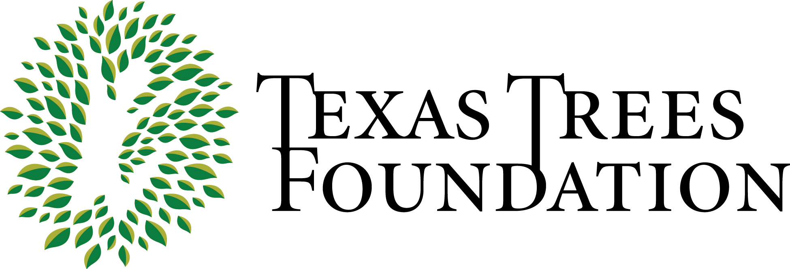

{width=80%}

# **Introduction**

This GitHub website is designed for Texas Tree Foundation. The main purpose of this website is to provide the data dictionary and a summary of the analysis.

# **Tabs**

* SWMD: This tab provides information on analysis for SWMD projects
* Cool Schools: This tab provides information on analysis for Cool Schools projects
* Urban Forestry: This tab provides information on analysis for Urban Forestry projects
* Data Dictionary: This tab provides information on variables in each database related to Pegasus parking 

</a>

